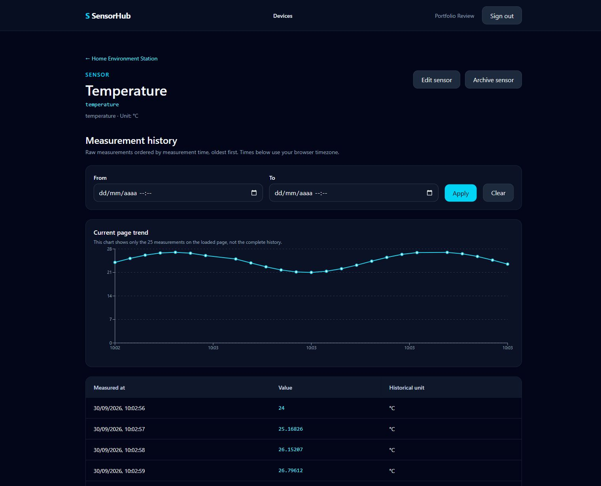
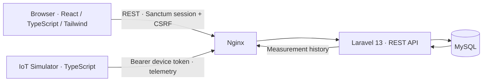
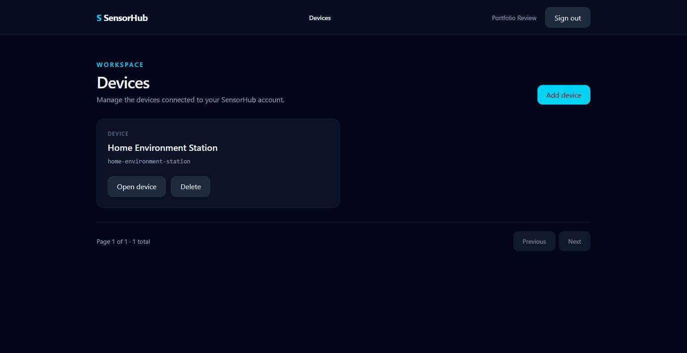
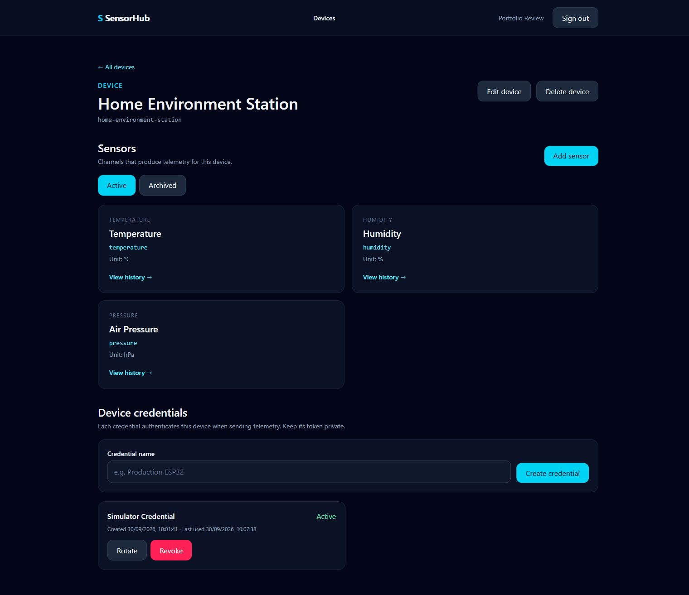

# SensorHub

SensorHub is an independent IoT monitoring portfolio project: manage devices and sensors in a React dashboard, ingest synthetic telemetry through a secured Laravel API, and explore historical measurements.

[](https://github.com/MatheusRodrigues-Dev/SensorHub/actions/workflows/ci.yml)



*Temperature history from the synthetic Home Environment Station. The chart shows the loaded page of raw measurements.*

## What SensorHub demonstrates

- Separate browser and IoT authentication: Sanctum sessions with CSRF for users; random, one-time device tokens stored as SHA-256 digests.
- Ownership policies, MySQL constraints, atomic telemetry batches, and historical measurement queries.
- A React dashboard with Device and Sensor management, archived history, credential metadata, pagination, and a chart of the current page of raw measurements.
- An independent TypeScript simulator that sends **synthetic telemetry** through the public API.
- Docker-first development and automated backend, frontend, simulator, and OpenAPI checks in GitHub Actions.

## V1 architecture



Docker Compose runs Nginx, the Laravel API, React development server, and MySQL. The simulator runs separately through an optional Compose profile. The browser reads measurements through the user API; the simulator writes them through the device API. See the [architecture guide](docs/architecture-v1.md) for details.

## Features and stack

| Area | Implemented V1 |
| --- | --- |
| API | Laravel 13, PHP 8.4, versioned REST API, OpenAPI 3.1 |
| Persistence | MySQL, Eloquent, ULIDs, constraints, transactions |
| Browser | React, TypeScript, Vite, Tailwind CSS 4, TanStack Query, Recharts |
| Security | Sanctum SPA sessions, CSRF, ownership policies, device Bearer credentials |
| Infrastructure | Docker Compose, Nginx, GitHub Actions |

Users can register, manage Devices and Sensors, create/rotate/revoke device credentials, rediscover archived Sensors, and browse paginated Measurement history. Device tokens are shown only when issued or rotated. Soft-deleted Sensors keep their historical measurements but cannot receive new telemetry.

## Product tour





All screenshots show synthetic demonstration data. Credential tokens are not shown.

## Quick start

The host needs Git and Docker Compose; PHP, Composer, Node.js, and MySQL run in containers.

```bash
git clone https://github.com/MatheusRodrigues-Dev/SensorHub.git
cd SensorHub
cp .env.example .env
# Set local DB_PASSWORD and DB_ROOT_PASSWORD in .env.
docker compose build
docker compose run --rm backend php artisan key:generate --show
# Paste the generated value into APP_KEY in .env.
docker compose up -d
docker compose exec backend php artisan migrate --force
```

Open [http://localhost](http://localhost) **after migrations complete**. On Windows PowerShell, use `Copy-Item .env.example .env` for the copy step. The [development guide](docs/development.md) covers setup, configuration, and troubleshooting.

## Try synthetic IoT telemetry

In the dashboard, create a Device and Sensor, then create a credential and save its one-time token. Set `SENSORHUB_DEVICE_ID`, `SENSORHUB_DEVICE_TOKEN`, and `SENSORHUB_SENSORS` in the ignored root `.env`, matching the Sensor's key and unit. Then run:

```bash
docker compose --profile simulator build simulator
docker compose --profile simulator run --rm simulator npm run once
```

Open that Sensor's history to see the synthetic reading in the table and chart. `npm run continuous` sends periodic batches until stopped. See [simulator configuration](simulator/.env.example) and the [development guide](docs/development.md). Never commit a device token.

## Testing and documentation

Backend, frontend, simulator, and OpenAPI validation run in [CI](https://github.com/MatheusRodrigues-Dev/SensorHub/actions/workflows/ci.yml). Local checks run through Docker:

```bash
docker compose exec backend php artisan test
docker compose exec backend ./vendor/bin/pint --test
docker compose exec frontend npm test
docker compose exec frontend npm run lint
docker compose exec frontend npm run build
docker compose --profile simulator run --rm --no-deps simulator npm test
```

- [Architecture and decisions](docs/architecture-v1.md) · [ADR](docs/adr/0001-modular-monolith-rest-api.md)
- [API guide](docs/api.md) · [OpenAPI contract](docs/openapi.yaml)
- [Database model](docs/database.md) · [Development guide](docs/development.md) · [Roadmap](docs/roadmap.md)

## Limits and future work

The chart shows only the currently loaded page of raw measurements. The simulator produces synthetic values; this is a portfolio and learning project, not a production deployment or a source of real device data. MQTT, Redis, queues, aggregation, alerts, and real-time updates are post-V1 considerations, not implemented features.

## License

SensorHub is licensed under the [MIT License](LICENSE). Copyright (c) 2026 Matheus de Sousa Rodrigues.
