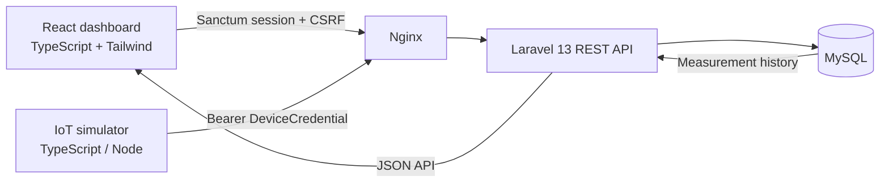

# SensorHub

[](https://github.com/MatheusRodrigues-Dev/SensorHub/actions/workflows/ci.yml)

**A Docker-first IoT monitoring platform built with Laravel, React, TypeScript, MySQL and a reproducible device simulator.**

SensorHub is an independent portfolio project that demonstrates end-to-end IoT application engineering: secure user and device authentication, REST API design, relational persistence, atomic telemetry ingestion, a responsive React dashboard, automated tests and CI. All demo telemetry is synthetic.

<!-- Portfolio screenshots to add before v1.0.0:
docs/screenshots/sensor-history.jpg
docs/screenshots/devices-dashboard.jpg
docs/screenshots/device-detail.jpg
-->

## What V1 demonstrates

- **Two authentication boundaries:** Sanctum session + CSRF for people, independent Bearer credentials for IoT devices.
- **IoT domain modeling:** users own Devices, Devices own Sensors and credentials, Sensors retain historical Measurements.
- **Safe telemetry ingestion:** device-scoped sensor resolution, unit validation and atomic batch persistence.
- **Full-stack product flow:** manage Devices and Sensors, inspect credential metadata, browse archived Sensors, filter Measurement history and visualize raw time-series data.
- **Docker-first reproducibility:** Nginx, Laravel, React, MySQL, isolated test MySQL and the simulator run through Docker Compose.
- **Engineering evidence:** backend, frontend and simulator tests, OpenAPI 3.1 documentation, formatting/linting and GitHub Actions CI.

## V1 architecture



The simulator behaves like an external device and communicates only through the public telemetry API. Device tokens are generated from 32 random bytes; only their SHA-256 digests are persisted. The plaintext token is shown only when a credential is created or rotated.

## Core capabilities

| Area | Implemented in V1 |
| --- | --- |
| Users | Registration, login, session restoration, logout and ownership policies |
| Devices | CRUD, scoped ownership and dependency-aware deletion |
| Sensors | CRUD, stable machine key, archived history and unit integrity |
| Device credentials | Create, list metadata, rotate and revoke |
| Telemetry | Bearer authentication, 1–100 reading batches, validation and transactional persistence |
| Measurements | UTC timestamps, historical unit snapshots, date filtering, pagination and chart/table views |
| Simulator | One-shot and continuous synthetic telemetry modes |
| Quality | PHPUnit, Vitest, React Testing Library, simulator tests, Pint, frontend lint/build, OpenAPI lint and CI health checks |

## Technology stack

| Layer | Technology |
| --- | --- |
| Backend | Laravel 13, PHP 8.4, Eloquent |
| API | REST `/api/v1`, OpenAPI 3.1 |
| Database | MySQL |
| Frontend | React, TypeScript, Vite, Tailwind CSS 4 |
| Server state | TanStack Query |
| Visualization | Recharts |
| Authentication | Laravel Sanctum + device Bearer credentials |
| Infrastructure | Docker Compose, Nginx |
| Testing | PHPUnit, Vitest, React Testing Library, Node test runner |
| CI | GitHub Actions |

## Quick start

Only **Git** and **Docker with Docker Compose** are required on the host.

```bash
git clone https://github.com/MatheusRodrigues-Dev/SensorHub.git
cd SensorHub
cp .env.example .env
docker compose build
docker compose run --rm backend php artisan key:generate --show
# Paste the generated value into APP_KEY in .env
docker compose up -d
docker compose exec backend php artisan migrate --force
```

Open `http://localhost` after the containers are healthy. On Windows PowerShell, use `Copy-Item .env.example .env` instead of `cp`.

For the complete environment, test and troubleshooting workflow, see [docs/development.md](docs/development.md).

## Try the IoT flow

1. Register in the React dashboard.
2. Create a Device and one or more Sensors.
3. Create a Device credential and save the one-time token.
4. Configure `SENSORHUB_DEVICE_ID`, `SENSORHUB_DEVICE_TOKEN` and `SENSORHUB_SENSORS` in the root `.env`.
5. Send synthetic telemetry with the independent simulator:

```bash
docker compose --profile simulator build simulator
docker compose --profile simulator run --rm simulator npm run once
```

Open the Sensor history page to inspect the persisted reading in both the table and the chart. Use `npm run continuous` in the simulator container for periodic synthetic batches.

## Repository layout

```text
backend/    Laravel REST API and domain
frontend/   React dashboard
simulator/  Independent TypeScript synthetic telemetry client
docker/     Nginx and PHP configuration
docs/       Architecture, API, database and development documentation
compose.yaml
```

## Quality gates

GitHub Actions validates the project in Docker on every push and pull request:

- Laravel test suite and Pint formatting check;
- frontend tests, lint and production build;
- simulator build and tests;
- OpenAPI 3.1 lint;
- application and Laravel health endpoints.

## Documentation

- [V1 architecture](docs/architecture-v1.md)
- [Architecture decision record](docs/adr/0001-modular-monolith-rest-api.md)
- [Database model](docs/database.md)
- [API guide](docs/api.md)
- [OpenAPI 3.1 contract](docs/openapi.yaml)
- [Docker development guide](docs/development.md)
- [Roadmap and post-V1 considerations](docs/roadmap.md)

## Scope and limitations

V1 deliberately favors synchronous HTTP ingestion and a modular monolith. It does **not** claim production readiness, real-time streaming, MQTT support or measured scalability. Redis, queues, MQTT, aggregation, alerting and deployment remain post-V1 considerations to be justified by concrete requirements.

## License

SensorHub is licensed under the [MIT License](LICENSE). Copyright (c) 2026 Matheus de Sousa Rodrigues.
